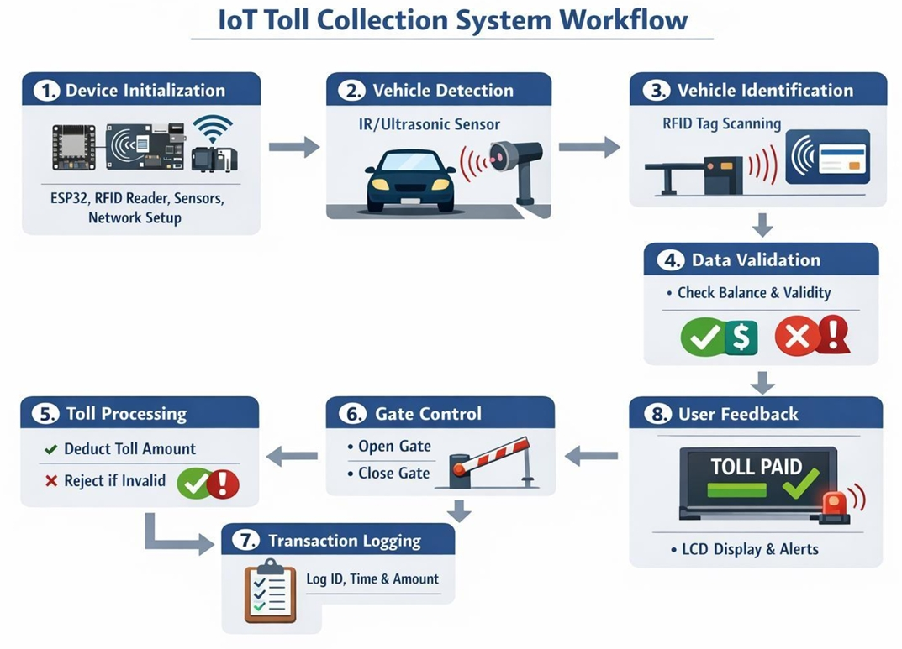
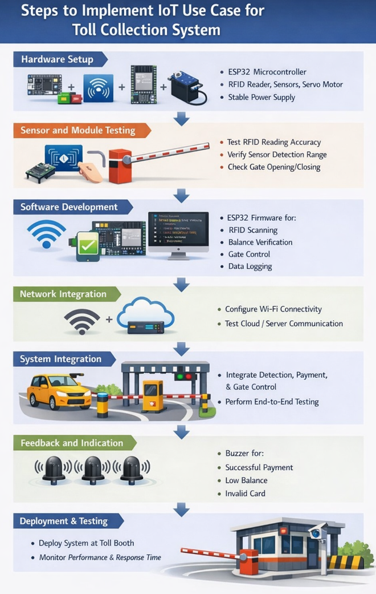

# Project Overview: IoT-Based Smart Toll Collection System using ESP32

---

### Problem

Traditional toll collection systems face several challenges, including:

1. **Traffic Congestion**: Manual toll booths cause long vehicle queues, increasing waiting times and fuel wastage.
2. **Human Error & Fraud**: Cash-based transactions are prone to errors, revenue leakage, and fraudulent activities.
3. **High Operational Costs**: Maintaining toll booths staffed with human operators is expensive and resource-intensive.
4. **Lack of Real-Time Data**: Authorities lack real-time insights into traffic flow, vehicle records, and transaction history.
5. **Slow Processing Speed**: Manual verification of vehicles and payment processing slows throughput significantly.
6. **Environmental Impact**: Idling vehicles at toll booths increase fuel consumption and carbon emissions.

---

### Proposed Solution

The IoT-Based Smart Toll Collection System leverages RFID technology, cloud integration, and real-time automation to streamline vehicle toll processing. The system includes the following key components and use cases:

1. **Automated Vehicle Detection**:
   - **Use Case**: IR sensors detect vehicle arrival at the toll booth and trigger the RFID scanning process.
   - **Benefit**: Eliminates the need for manual vehicle identification, speeding up throughput significantly.

2. **RFID-Based Identity Verification**:
   - **Use Case**: The RFID reader (RC522) scans the vehicle's RFID tag, retrieves the registered vehicle and account details, and verifies balance in real time.
   - **Benefit**: Provides fast, contactless, and accurate vehicle identification with minimal human intervention.

3. **Automated Gate Control**:
   - **Use Case**: A servo motor controls the toll gate, opening it automatically upon successful balance verification and keeping it closed for unauthorized or low-balance vehicles.
   - **Benefit**: Ensures only valid, registered vehicles with sufficient balance can pass, improving security and enforcement.

4. **Cloud Data Logging via Google Apps Script & Sheets**:
   - **Use Case**: Every transaction — including vehicle ID, timestamp, deducted amount, and remaining balance — is logged in real time to Google Sheets via Google Apps Script.
   - **Benefit**: Provides a persistent, accessible, and cost-effective cloud database for transaction records and audits.

5. **Web Interface for Monitoring**:
   - **Use Case**: Administrators access a web dashboard (HTML/CSS) to monitor live transaction records, vehicle histories, and system status.
   - **Benefit**: Enables centralized oversight, report generation, and operational decision-making from any device.

6. **User Feedback via Buzzer**:
   - **Use Case**: The buzzer provides immediate audio feedback — a short beep for successful passage and a long or repeated beep for denied entry.
   - **Benefit**: Improves user experience by giving drivers clear, instant status signals without requiring visual confirmation.

---

### Key Components

1. **ESP32 Microcontroller**: The central processing unit of the system. It interfaces with all hardware components (RFID reader, sensors, servo motor, buzzer) and handles Wi-Fi communication to send transaction data to the cloud.

2. **RFID Reader (RC522)**: Reads data from vehicle-mounted RFID tags using SPI communication. It extracts the unique tag ID which is used to look up vehicle and account information.

3. **RFID Tags**: Attached to each registered vehicle. Each tag stores a unique identifier linked to the vehicle owner's account in the database, including balance and registration details.

4. **IR Sensors**: Detects vehicle presence at the toll gate. When a vehicle arrives, the sensor triggers the ESP32 to activate the RFID scanning and verification sequence.

5. **Servo Motor**: Controls the physical toll gate arm. Receives a signal from the ESP32 to open (90°) or remain closed (0°) based on the verification outcome.

6. **Buzzer**: Provides audio feedback to the driver. Emits a short beep on successful toll deduction and a prolonged or pattern-based alert on access denial.

7. **Google Apps Script**: Acts as the backend API layer. Receives HTTP POST requests from the ESP32 containing transaction data, processes them, and writes records to the Google Sheets database.

8. **Google Sheets**: Serves as the cloud database. Stores all transaction records including Tag ID, vehicle details, toll amount deducted, remaining balance, timestamp, and access status.

9. **Web Interface (HTML/CSS)**: A lightweight frontend dashboard that displays real-time and historical toll transaction data fetched from Google Sheets, accessible to administrators via a browser.

---

### IoT System Architecture

---

---
### Practical Setup

---

### Website Images

---

### Operation

1. A vehicle approaches the toll booth and is detected by the **IR sensors**, which signals the ESP32 to begin the toll collection sequence.

2. The **ESP32** activates the **RFID Reader (RC522)**, which scans the vehicle's RFID tag and retrieves its unique tag ID.

3. The ESP32 sends an **HTTP POST request** to the **Google Apps Script** endpoint, passing the scanned tag ID.

4. The **Google Apps Script** queries the **Google Sheets database** to verify if the tag is registered and whether the account holds a sufficient balance.

5. If the balance is valid:
   - The script deducts the toll fee, updates the balance, and logs the transaction (Tag ID, amount, timestamp, status) to Google Sheets.
   - The ESP32 receives a success response, commands the **servo motor** to open the gate (90°), and triggers the **buzzer** for a short confirmation beep.

6. If the tag is unregistered or the balance is insufficient:
   - The ESP32 receives a denial response, the gate remains closed (0°), and the **buzzer** emits a repeated alert signal to notify the driver.

7. After the vehicle passes (or a timeout occurs), the **servo motor** automatically returns the gate to the closed position, resetting the system for the next vehicle.

8. Administrators can monitor all toll transactions, vehicle records, and system activity in real time through the **web dashboard**, which fetches data from Google Sheets.

---

### Challenges

1. Ensuring reliable RFID read accuracy in varying environmental conditions (rain, heat, physical obstructions).
2. Maintaining stable Wi-Fi connectivity for the ESP32 in outdoor or remote toll booth deployments.
3. Handling simultaneous vehicle arrivals and preventing race conditions in cloud transaction logging.
4. Securing the Google Apps Script endpoint against unauthorized POST requests and data tampering.
5. Managing Google Sheets API rate limits under high-traffic toll scenarios.
6. Ensuring servo motor durability and precise control under continuous mechanical operation.
7. Developing an intuitive web interface for non-technical toll administrators.
8. Integrating the system with existing toll infrastructure and regulatory compliance requirements.
9. 
---

### Backend and Frontend Architecture

In this setup, the ESP32 acts as the embedded client device, while the backend logic is handled serverlessly through **Google Apps Script**, and the frontend is a static **HTML/CSS web page** that queries Google Sheets directly.

#### Components

1. **ESP32 (Embedded Client)**: Collects sensor and RFID data, performs local control logic (servo, buzzer), and communicates with the cloud backend via HTTP over Wi-Fi.

2. **Google Apps Script (Backend API)**: A serverless backend deployed as a Web App. Handles all business logic — tag verification, balance deduction, and transaction logging — triggered by HTTP POST requests from the ESP32.

3. **Google Sheets (Cloud Database)**: Stores registered vehicle records and all transaction history. Acts as a lightweight, accessible, and cost-free cloud database accessible from both the script and the web dashboard.

4. **Web Interface / Dashboard (Frontend)**: A static HTML/CSS page hosted locally or on a simple web server. Fetches data from Google Sheets via the Sheets API or Apps Script and displays it in a structured, readable format for administrators.

---

## Documentation

For a more detailed explanation, please refer to the [IoT_Toll_Collection_Report.pdf](IoT_Project_Report.pdf).
